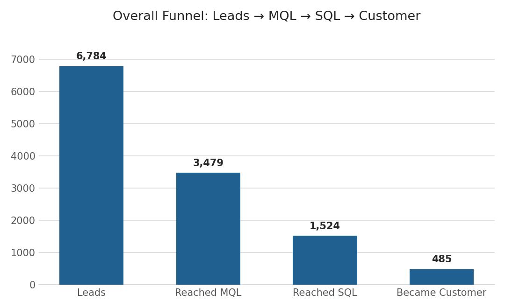
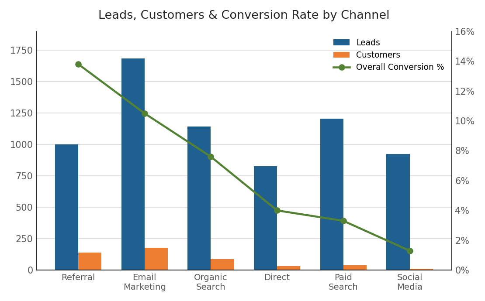
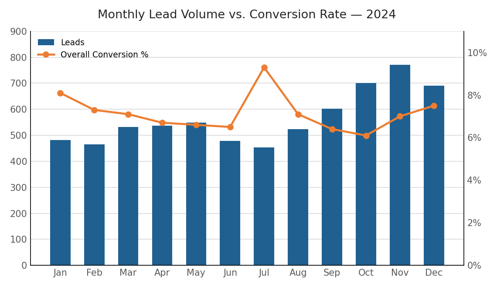
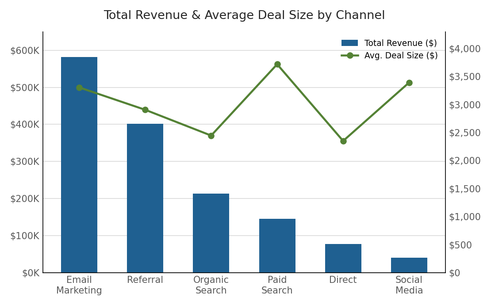

# 🔻 Marketing Funnel & Conversion Analysis

An end-to-end funnel analysis project built in Excel, using a simulated marketing/sales funnel dataset (6,784 leads across 2024) to identify where users drop off between visitor and customer, which channels bring high-quality leads, and how conversion can be improved.

This project was completed as part of a data analytics internship task, simulating real work done by growth analysts, marketing analysts, and sales operations teams at startups and agencies.

---

## 🎯 Project Objective

Help a business answer key funnel questions:
- Where are users dropping off in the funnel?
- Which channels bring high-quality leads, not just high volume?
- How can conversion rates be improved at each stage?
- Which stages need the most optimization?

---

## 🗂️ Repository Structure

```
Funnel-Analysis/
├── raw-data/
│   ├── leads.csv                        # Lead-level records (Lead → MQL → SQL → Customer)
│   └── traffic_summary.csv              # Monthly visitor counts by channel
├── cleaned-data/
│   └── Leads_Cleaned.xlsx               # Cleaned data + helper columns (Stage Number, funnel flags)
├── dashboard/
│   └── Funnel_Dashboard.xlsx            # PivotTables + PivotCharts (Excel dashboard)
├── report/
│   └── Funnel_Analysis_Report.docx      # Client-ready written report with charts & recommendations
├── screenshots/
│   ├── chart_overall_funnel.png
│   ├── chart_channel.png
│   ├── chart_monthly_trend.png
│   └── chart_revenue.png
└── README.md
```

---

## 🛠️ Tools Used

- **Microsoft Excel** — data cleaning (Text to Columns, table structuring), PivotTables, PivotCharts
- **Excel formulas** — `SWITCH()` / `IFS()`, binary funnel-stage flags, `TEXT()` for month grouping

---

## 🧹 Data Cleaning Steps

1. Converted the raw leads CSV into a structured Excel Table (`LeadsData`)
2. Checked for and confirmed no duplicate lead records
3. Fixed `Signup Date` where stored as text, converting to proper date format
4. Verified no missing values in required fields (`Lead ID`, `Signup Date`, `Channel`, `Campaign`, `Funnel Stage Reached`) — while correctly preserving intentional blanks in `Days to Convert`, `Plan`, and `Deal Value` for leads that never converted to Customer
5. Added helper columns for funnel analysis:
   - `Stage Number` — numeric encoding of funnel stage (Lead=1, MQL=2, SQL=3, Customer=4)
   - `Signup Month` — for time-trend analysis
   - `Reached MQL+`, `Reached SQL+`, `Reached Customer` — binary flags used to calculate stage-by-stage conversion in PivotTables

---

## 📈 Key Insights

### 1. The steepest drop-off happens early: Lead → MQL
Of 6,784 leads, only 3,479 (51.3%) reach MQL, 1,524 (43.8% of MQLs) reach SQL, and 485 (31.8% of SQLs) become customers — an overall Lead → Customer conversion of just **7.1%**.



**Recommendation:** Focus improvement efforts on lead nurturing and qualification criteria rather than the sales close — the SQL → Customer stage is comparatively healthy, but nearly half of all leads never even reach MQL.

---

### 2. Referral and Email Marketing are the highest-quality channels
Referral converts leads to customers at **13.8%** — nearly 11x the rate of Social Media (**1.3%**). Email Marketing produces the most leads (1,684) *and* converts well (10.5%), making it the most efficient high-volume channel.



**Recommendation:** Prioritize continued investment in Email Marketing and Referral programs. Investigate the Social Media funnel path specifically (landing page fit, targeting, qualification criteria) before scaling spend further there.

---

### 3. Lead volume grew all year — but conversion efficiency didn't scale with it
Monthly leads grew ~60% from January (481) to November (771), while overall conversion stayed flat or softened slightly (8.1% → 7.0%), dipping in the highest-volume months.



**Recommendation:** Before increasing top-of-funnel spend further, invest in conversion efficiency (lead scoring, faster follow-up, stronger MQL criteria) so lead growth translates into proportional customer growth.

---

### 4. Revenue tells a more nuanced story than conversion rate alone
Email Marketing drives 40% of total revenue ($581,838 of $1,459,166). But Paid Search — one of the weakest channels by conversion rate — actually produces the **highest average deal size** ($3,719), even above Referral ($2,907).



**Recommendation:** Rather than cutting Paid Search or Social Media spend, fix the qualification process for these channels — their customers are valuable, but too few leads make it through.

---

## ✅ Summary of Recommendations

| Priority | Action | Target |
|---|---|---|
| 1 | Improve Lead → MQL qualification and nurturing | All channels — the largest funnel leak |
| 2 | Increase investment in Email Marketing & Referral | Proven high-volume and high-quality channels |
| 3 | Audit landing pages and targeting rather than cutting spend | Social Media, Paid Search |
| 4 | Address flat conversion efficiency before scaling volume further | Overall lead generation strategy |
| 5 | Study July's conversion spike (9.3%, the year's best) for repeatable tactics | Campaign/timing analysis |

---

## 📄 Full Report

The complete client-ready report — with executive summary, all charts, data tables, and detailed recommendations — is available here:
👉 [`report/Funnel_Analysis_Report.docx`](report/Funnel_Analysis_Report.docx)

---

## 🧠 What I Learned

- How to structure and analyze multi-stage funnel data using binary stage flags in PivotTables
- The difference between conversion *rate* and conversion *value* — a channel can be weak on one and strong on the other
- Why "more leads" isn't automatically "more revenue" if conversion efficiency doesn't scale alongside volume
- How to separate top-of-funnel (aggregate traffic) data from bottom-of-funnel (individual lead/CRM) data, which is how funnel data is typically structured in the real world
- Turning funnel metrics into a business narrative: observation → why it matters → recommendation

---

## 📬 Connect

If you're a founder, marketer, or fellow analyst and want to discuss this project or a similar funnel analysis for your own data, feel free to reach out on [LinkedIn](#).

*Dataset: Simulated marketing funnel data (6,784 leads, 6 channels, January–December 2024), built to reflect realistic funnel drop-off and channel-quality patterns.*
